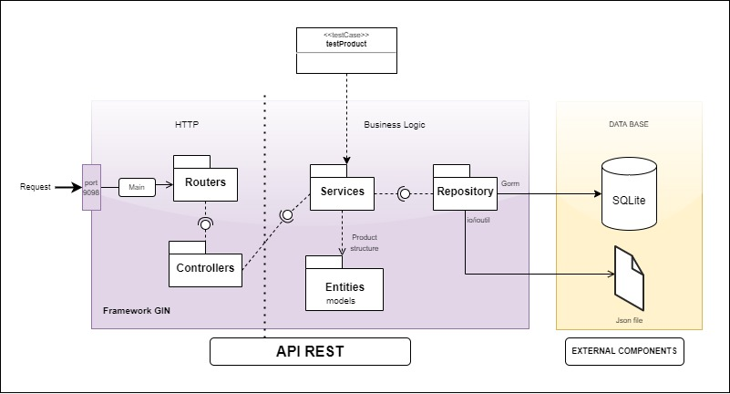

# Api Rest con GO, GOLAN

[](https://app.travis-ci.com/vanessatocasuche/apirestGo)

Este desarrollo es una API Rest que expone endpoints CRUD, para gestionar productos y un endpoint GET para Volumenes.


##Contenido
- Diseño
  - Estructura (Diagrama de componentes)
  - Principios y patrones de diseño
- Ambiente de trabajo
- Clonar proyecto
- Instalación de librerías
- Configuración de la Base de Datos
- Correr el proyecto
- Endpoints: GET, POST, PUT, DELETE
- Pruebas unitarias
  
## Diseño

### Estructura (Diagrama de componentes)

El diseño consta de 3 modulos básicos:
1. **HTTP:** Modulo que ofrece los servicios al cliente, este recibe las peticiones.
2. **Lógica de negocio:** Espacio donde estan los requerimientos del sistema.
3. **Base de datos:** Aplicación que nos proporciona los datos
<br>(Esto modulo está por fuera del repositorio porque es un servicio que nos proporciona otra aplicación)</br>




### Principios y patrones de diseño

En la API REST se evidencia el uso de los principios de diseño SOLID, como lo son **responsabilidad única** (para  *test*, ... ), **abierto cerrado** (con el uso de interfaces).

Patrones de diseño como **singleton** (Instancias únicas de implementación).

## Ambiente de trabajo

El desarrollo se realizó en la aplicación GolandID proporcionada por JetBrains.

En este caso el servicio de la Base de datos lo proporciono la aplicación SQLiteStudio.

## Clonar proyecto

Para clonar el proyecto se debe inicialmente configurar el espacio de trabajo.

Para esta API se hizo lo siguiente:
  1. Elegir una ruta especifica para manejar los proyectos de GO. <br>En las variables de entorno se agregó con el nombre `GOPATH` esta ruta.</br>
  2. Crear dentro de esta carpeta se crea la ruta como se va a configurar el proyecto en GO. Para esto, consulte, *esquema de carpetas para trabajar con GO*.
  3. Una vez ubicado en la carpeta donde desea clonar el proyecto, desde la consola ejecutar:
  ```git
  git clone https://github.com/vanessatocasuche/apirestGo.git
  ```
Una vez realizados estos pasos puede abrir el proyecto desde la aplicación GolandIDE.

## Instalación de librerías

El archivo *go.mod* contiene las librerías necesarias para ejecutar el proyecto, por esto, desde la ubicación del archivo *go.mod*, ejecutar:
  ```
  go mod tidy
  ```

## Configuración con la Base de Datos

### Ruta donde se aloja la BD Sqlite:

La ruta relativa donde vas a la base de datos debes configurarla aquí `repository/productRespository.go`, en la linea:
````go
const LOCATIONFILE string = "../../../../db/db-apirest-go.db"
````

### Crear la BD
Puede crear la Base de manualmente con el siguiente modelo:
```sqlite
CREATE TABLE products (
    id_product       VARCHAR (255) DEFAULT primary_key,
    name             VARCHAR (255) DEFAULT not_null,
    description      VARCHAR (300),
    status           VARCHAR (45),
    creation_date    DATETIME      DEFAULT CURRENT_TIMESTAMP,
    update_date      DATETIME      DEFAULT CURRENT_TIMESTAMP,
    account_id       VARCHAR (25),
    format_product   VARCHAR,
    value_unit       REAL          DEFAULT not_null,
    unit_name        VARCHAR (255) DEFAULT not_null,
    unit_description VARCHAR (300),
    stock            INT
)
```
En su defecto, dejar que al correr la aplicación la primera vez, está CREARÁ LA BASE DE DATOS MANUALMENTE.

## Correr el proyecto

Desde la terminal, ubicado en la ruta raíz del proyecto, ejecutar:
  ```
  $ go run main.go
  ```
En caso de que presente conflicto en correr el proyecto, deberá visualizar, probablemente qué librerías no instaló automáticamente y ejecutar: `go get LIBRERÍA_REQUERIDA`

## Endpoints de la API

La API ofrece los servicios de GET, POST, PULL, DELETE para los productos, y de GET, con Autenticacón básica para Volumenes.

*Product*
- GET:   `localhost:9098/products`<br>Extrae todos los productos de la base de datos.<br></br>
- GET:   `localhost:9098/products/ID_PRODUCT`<br>Extrae el producto con llave *ID_PRODUCT*.<br></br>
- POST:  `localhost:9098/products`<br>Guarda el producto que le envíes en el cuerpo</br>El cuerpo de este, será anexado al finalizar.<br></br>
- PUT:   `localhost:9098/product/ID_PRODUCT`<br>Actualiza el producto con llave *ID_PRODUCT*, con los datos del cuerpo del producto que le envíes.<br></br>
- DELETE:`localhost:9098/products/ID_PRODUCT`<br>Elimina el producto con la llave *ID_PRODUCT*.<br></br>
````json
{
  "id_product": "",
  "name": "",
  "description": "",
  "status": "",
  "created_date": "2019-01-01T09:41:32-05:00",
  "update_date": "2022-02-06T23:14:01-05:00",
  "account_id": "",
  "format_product": "",
  "value_unit": 0,
  "unit_name": "",
  "unit_description": "",
  "stock": 0
}
````

*Volume*
- GET : `localhost:9098/volume`<br>Extrae el archivo `volumen_list.json`.</br>
<br> Aquí es necesario la autenticacion de los usuarios. Los nombres de usuario y las contraseñas se pueden modificar en el archivo `route/roteApi.go` en la función.
````go
func getUsers() map[string]string {

	m := make(map[string]string) // users and passwords are staying admitted to basicAuth

	m["admin"] = "admin1"
	m["vane"] = "vane1"

	return m
}
````

## Pruebas unitarias

### librerías
En este proyecto se utilizaron las librerías **ginkgo** y **gomega**.
Para la instalación manual, ejecutar desde la terminal:
```
$ go get github.com/onsi/ginkgo/ginkgo
$ go get github.com/onsi/gomega/...
```

### Realizar las pruebas

Para realizar las pruebas unitarias es suficiente con abrir la terminal y ubicarse en el paquete `test/` y ejecutar el comando  
````
# para obtener más información debes de agregar el parametro "-v"
go test
````

<br></br>
<br></br>
<br></br>
<br></br>


